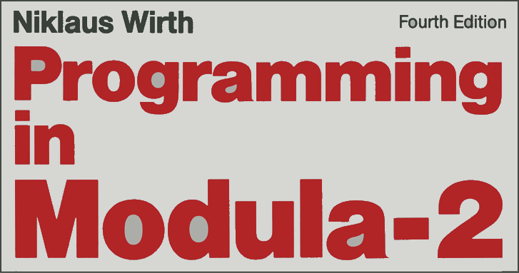

# Playing with Modula-2 on Windows

<table style="font-family:Helvetica,Arial;line-height:1.6;">
  <tr>
  <td style="border:0;padding:0 10px 0 0;min-width:25%;"></td>
  <td style="border:0;padding:0;vertical-align:text-top;">This repository gathers <a href="https://link.springer.com/chapter/10.1007/978-3-642-96757-3_1" rel="external">Modula-2</a> code examples coming from various websites and books. 
  It also includes several build scripts (<a href="https://en.wikibooks.org/wiki/Windows_Batch_Scripting" rel="external">batch files</a>) for experimenting with <a href="https://link.springer.com/chapter/10.1007/978-3-642-96757-3_1" rel="external">Modula-2</a> on a Windows machine.
  </td>
  </tr>
</table>

[Ada][ada_examples], [Akka][akka_examples], [C++][cpp_examples], [COBOL][cobol_examples],  [Dart][dart_examples], [Deno][deno_examples], [Docker][docker_examples], [Erlang][erlang_examples], [Flix][flix_examples], [Golang][golang_examples], [GraalVM][graalvm_examples], [Haskell][haskell_examples], [Kafka][kafka_examples], [Kotlin][kotlin_examples], [LLVM][llvm_examples], [Node.js][nodejs_examples], [Rust][rust_examples], [Scala 3][dotty_examples], [Spark][spark_examples], [Spring][spring_examples], [TruffleSqueak][trufflesqueak_examples], [Wix Toolset][wix_examples] and [Zig][zig_examples] are other topics we are continuously monitoring.

## Project dependencies

This project depends on the following external software for the **Microsoft Windows** platform:

- [ADW Modula-2 1.6][adwm2_downloads] ([*release notes*][adwm2_relnotes])
- [Git 2.45][git_downloads] ([*release notes*][git_relnotes])
- *(Hopefully soon: [GNU Modula-2][gm2_downloads])*
- [MSYS2 2024][msys2_releases] ([*change log*][msys2_changelog])
- [XDS Modula-2 2.60][xdsm2_downloads]

Optionally one may also install the following software:

- [ConEmu 2023][conemu_downloads] ([*release notes*][conemu_relnotes])
- [Visual Studio Code 1.90][vscode_downloads] ([*release notes*][vscode_relnotes])

> **&#9755;** ***Installation policy*** 
> When possible we install software from a [Zip archive][zip_archive] rather than via a [Windows installer][windows_installer]. In our case we defined **`C:\opt\`** as the installation directory for optional software tools (*in reference to* the [`/opt/`][unix_opt] directory on Unix).

For instance our development environment looks as follows (*July 2024*) [1](#footnote_01):

<pre style="font-size:80%;">
C:\opt\ADW-Modula-2\    <i>(108 MB)</i>
C:\opt\ConEmu\          <i>( 26 MB)</i>
C:\opt\Git\             <i>(367 MB)</i>
C:\opt\VSCode\          <i>(341 MB)</i>
C:\opt\XDS-Modula-2\<a href="#footnote_02">2</a>   <i>( 29 MB)</i>
</pre>

> **:mag_right:** [Git for Windows][git_releases] provides a Bash emulation used to run [**`git.exe`**][git_cli] from the command line (as well as over 250 Unix commands like [**`awk`**][man1_awk], [**`diff`**][man1_diff], [**`file`**][man1_file], [**`grep`**][man1_grep], [**`more`**][man1_more], [**`mv`**][man1_mv], [**`rmdir`**][man1_rmdir], [**`sed`**][man1_sed] and [**`wc`**][man1_wc]).

## Directory structure [**&#x25B4;**](#top)

This project is organized as follows:

<pre style="font-size:80%;">
adw-examples\{<a href="adw-examples/README.md">README.md</a>}
docs\
examples\{<a href="examples/README.md">README.md</a>, <a href="./examples/Factorial/">Factorial</a>, <a href="./examples/Hello/">Hello</a>, <a href="./examples/PascalTriangle/">PascalTriangle</a>, ..}
xds-examples\{<a href="xds-examples/README.md">README.md</a>}
README.md
<a href="RESOURCES.md">RESOURCES.md</a>
<a href="setenv.bat">setenv.bat</a>
</pre>

where

- directory [**`docs\`**](docs/) contains [Modula-2][pim4] related papers/articles (see file [**`docs\README.md`**](docs/README.md)).
- directory [**`examples\`**](examples/) contains [Modula-2][pim4] examples grabbed from various websites (see file [**`examples\README.md`**](examples/README.md)).
- file [**`README.md`**](README.md) is the [Markdown][github_markdown] document for this page.
- file [**`RESOURCES.md`**](RESOURCES.md) is the [Markdown][github_markdown] document presenting external resources.
- file [**`setenv.bat`**](setenv.bat) is the batch command for setting up our environment.

We also define a virtual drive &ndash; e.g. drive **`T:`** &ndash; in our working environment in order to reduce/hide the real path of our project directory (see article ["Windows command prompt limitation"][windows_limitation] from Microsoft Support).
> **:mag_right:** We use the Windows external command [**`subst`**][windows_subst] to create virtual drives; for instance:
>
> <pre style="font-size:80%;">
> <b>&gt; <a href="https://docs.microsoft.com/en-us/windows-server/administration/windows-commands/subst">subst</a> T: <a href="https://en.wikipedia.org/wiki/Environment_variable#Default_values">%USERPROFILE%</a>\workspace\m2-examples</b>
> </pre>

In the next section we give a brief description of the batch files present in this project.

## Batch/Bash commands

### **`setenv.bat`** [3](#footnote_03)

We execute command [**`setenv.bat`**](setenv.bat) once to setup our development environment; it makes external tools such as [**`git.exe`**][git_cli] and [**`sh.exe`**][sh_cli] directly available from the command prompt.

   <pre style="font-size:80%;">
   <b>&gt; <a href="./setenv.bat">setenv</a></b>
   Tool versions:
      m2amd64 1.6.879, xc v2.60, make 4.4.1,
      git 2.45.2, diff 3.10, bash 5.2.26(1)
   &nbsp;
   <b>&gt; <a href="https://learn.microsoft.com/en-us/windows-server/administration/windows-commands/where" rel="external">where</a> git sh</b>
   C:\opt\Git\bin\git.exe
   C:\opt\Git\mingw64\bin\git.exe
   C:\opt\Git\bin\sh.exe
   C:\opt\Git\usr\bin\sh.exe
   </pre>

<!--=======================================================================-->

## Footnotes [**&#x25B4;**](#top)

[1] ***Downloads*** [↩](#anchor_01)

<dl><dd>
In our case we downloaded the following installation files (<a href="#proj_deps">see section 1</a>):

<pre style="font-size:80%;">
<a href="https://www.modula2.org/adwm2/download.php" rel="external">ADWM2Setup.exe</a>                    <i>( 18 MB)</i>
<a href="https://github.com/Maximus5/ConEmu/releases/tag/v23.07.24" rel="external">ConEmuPack.230724.7z</a>              <i>(  5 MB)</i>
<a href="https://git-scm.com/download/win" rel="external">PortableGit-2.45.2-64-bit.7z.exe</a>  <i>( 41 MB)</i>
<a href="https://code.visualstudio.com/Download#" rel="external">VSCode-win32-x64-1.90.2.zip</a>       <i>(131 MB)</i>
<a href="https://github.com/excelsior-oss/xds-ide/releases">xds-ide-1.7.0-060713-1-win32.zip</a>  <i>(198 MB)</i>
</pre>
</dd></dl>

[2] ***Excelsior XDS Modula-2*** [↩](#anchor_02)

<dl><dd>
The <a href="https://github.com/excelsior-oss/xds-2.60">XDS Modula-2 SDK 2.6</a> is included in the Zip archive <a href="https://github.com/excelsior-oss/xds-ide/releases" rel="external">Excelsior XDS Modula-2 IDE 1.7.0</a>. Concretely we simply extract the <code><b>xds-ide\sdks\XDS-x86\</b></code> subdirectory (thus ignoring the Eclipse IDE related stuff). In our case we created a directory <code><b>C:\opt\XDS-Modula-2\</b></code> :

<pre style="font-size:80%;">
<b>&gt; <a href="https://learn.microsoft.com/en-us/windows-server/administration/windows-commands/tree" rel="external">tree</a> /a c:\opt\XDS-Modula-2 | <a href="https://learn.microsoft.com/en-us/windows-server/administration/windows-commands/findstr" rel="external">findstr</a> /b +</b>
+---bin
+---c
+---def
+---include
+---lib
+---licenses
+---pdf
+---readme
+---samples
&nbsp;
<b>&gt; <a href="https://learn.microsoft.com/en-us/windows-server/administration/windows-commands/dir">dir</a> /b c:\opt\XDS-Modula-2\bin\*.exe</b>
h2d.exe        <i>(<a href="http://computer-programming-forum.com/26-programming-language/d41077d4e2e3f40d.htm">C headers to Modula-2 definition modules translator</a>)</i>
his.exe        <i>(XDS History formatter)</i>
xc.exe         <i>(XDS Compiler for Oberon-2/Modula-2)</i>
xd.exe         <i>(XDS Debugger &ndash; native x86 edition)</i>
xdasm.exe      <i>(XDS Disassembler)</i>
xds.exe        <i>(XDS Standalone IDE)</i>
xd_demon.exe
xd_srv.exe
xlib.exe       <i>(XDS Library manager)</i>
xlink.exe      <i>(XDS Link)</i>
xm.exe         <i>(O2/M2 development system)</i>
xpdump.exe     <i>(XDS Profiler)</i>
xprof.exe      <i>(XDS Profiler)</i>
xprofmem.exe
xpview.exe     <i>(XDS Profile viewer)</i>
xrc.exe        <i>(XDS Resource compiler)</i>
xstrip.exe     <i>(XDS Debug Info Stripper)</i>
</pre>
</dd></dl>

[3] **`setenv.bat` *usage*** [↩](#anchor_03)

<dl><dd>
Batch file <a href=./setenv.bat><code><b>setenv.bat</b></code></a> has specific environment variables set that enable us to use command-line developer tools more easily.
</dd>
<dd>It is similar to the setup scripts described on the page <a href="https://learn.microsoft.com/en-us/visualstudio/ide/reference/command-prompt-powershell" rel="external">"Visual Studio Developer Command Prompt and Developer PowerShell"</a> of the <a href="https://learn.microsoft.com/en-us/visualstudio/windows" rel="external">Visual Studio</a> online documentation.
</dd>
<dd>
For instance we can quickly check that the two scripts <code><b>Launch-VsDevShell.ps1</b></code> and <code><b>VsDevCmd.bat</b></code> are indeed available in our Visual Studio 2019 installation :
<pre style="font-size:80%;">
<b>&gt; <a href="https://learn.microsoft.com/en-us/windows-server/administration/windows-commands/where" rel="external">where</a> /r "C:\Program Files (x86)\Microsoft Visual Studio" *vsdev*</b>
C:\Program Files (x86)\Microsoft Visual Studio\2019\Community\Common7\Tools\Launch-VsDevShell.ps1
C:\Program Files (x86)\Microsoft Visual Studio\2019\Community\Common7\Tools\VsDevCmd.bat
C:\Program Files (x86)\Microsoft Visual Studio\2019\Community\Common7\Tools\vsdevcmd\core\vsdevcmd_end.bat
C:\Program Files (x86)\Microsoft Visual Studio\2019\Community\Common7\Tools\vsdevcmd\core\vsdevcmd_start.bat
</pre>
</dd>
<dd>
Concretely, in our GitHub projects which depend on Visual Studio (e.g. <a href="https://github.com/michelou/cpp-examples"><code>michelou/cpp-examples</code></a>), <a href="./setenv.bat"><code><b>setenv.bat</b></code></a> does invoke <code><b>VsDevCmd.bat</b></code> (resp. <code><b>vcvarall.bat</b></code> for older Visual Studio versions) to setup the Visual Studio tools on the command prompt. 
</dd></dl>

***

*[mics](https://lampwww.epfl.ch/~michelou/)/July 2024* [**&#9650;**](#top)
&nbsp;

<!-- link refs -->

[ada_examples]: https://github.com/michelou/ada-examples#top
[adwm2_downloads]: https://www.modula2.org/adwm2/download.php
[adwm2_relnotes]: https://www.modula2.org/adwm2/
[akka_examples]: https://github.com/michelou/akka-examples#top
[apache_maven_cli]: https://maven.apache.org/ref/3.9.6/maven-embedder/cli.html
[bazel_changelog]: https://github.com/bazelbuild/bazel/blob/master/CHANGELOG.md
[bazel_home]: https://www.bazel.build/
[bazel_releases]: https://github.com/bazelbuild/bazel/releases
[bazel_userguide]: https://bazel.build/build/style-guide
[cobol_examples]: https://github.com/michelou/cobol-examples#top
[conemu_downloads]: https://github.com/Maximus5/ConEmu/releases
[conemu_relnotes]: https://conemu.github.io/blog/2023/07/24/Build-230724.html
[cpp_examples]: https://github.com/michelou/cpp-examples#top
[dart_examples]: https://github.com/michelou/dart-examples#top
[deno_examples]: https://github.com/michelou/deno-examples#top
[docker_examples]: https://github.com/michelou/docker-examples#top
[dotty_examples]: https://github.com/michelou/dotty-examples#top
[erlang_examples]: https://github.com/michelou/erlang-examples#top
[flix_examples]: https://github.com/michelou/flix-examples#top
[git_downloads]: https://git-scm.com/download/win
[git_cli]: https://git-scm.com/docs/git
[git_releases]: https://git-scm.com/download/win
[git_relnotes]: https://raw.githubusercontent.com/git/git/master/Documentation/RelNotes/2.45.2.txt
[github_markdown]: https://github.github.com/gfm/
[gm2_downloads]: https://gcc.gnu.org/onlinedocs/gcc-13.1.0/gm2/Overview.html
[golang_examples]: https://github.com/michelou/golang-examples#top
[graalvm_examples]: https://github.com/michelou/graalvm-examples#top
[haskell_examples]: https://github.com/michelou/haskell-examples#top
[kafka_examples]: https://github.com/michelou/kafka-examples#top
[kotlin_examples]: https://github.com/michelou/kotlin-examples#top
[linux_opt]: https://tldp.org/LDP/Linux-Filesystem-Hierarchy/html/opt.html
[llvm_examples]: https://github.com/michelou/llvm-examples#top
[man1_awk]: https://www.linux.org/docs/man1/awk.html
[man1_diff]: https://www.linux.org/docs/man1/diff.html
[man1_file]: https://www.linux.org/docs/man1/file.html
[man1_grep]: https://www.linux.org/docs/man1/grep.html
[man1_more]: https://www.linux.org/docs/man1/more.html
[man1_mv]: https://www.linux.org/docs/man1/mv.html
[man1_rmdir]: https://www.linux.org/docs/man1/rmdir.html
[man1_sed]: https://www.linux.org/docs/man1/sed.html
[man1_wc]: https://www.linux.org/docs/man1/wc.html
[msys2_changelog]: https://github.com/msys2/setup-msys2/blob/master/CHANGELOG.md
[msys2_releases]: https://github.com/msys2/msys2-installer/releases
[nodejs_examples]: https://github.com/michelou/nodejs-examples#top
[nodejs_home]: https://www.nodejs.org
[pim4]: https://link.springer.com/chapter/10.1007/978-3-642-96757-3_1
[rust_examples]: https://github.com/michelou/rust-examples#top
[sh_cli]: https://man7.org/linux/man-pages/man1/sh.1p.html
[spark_examples]: https://github.com/michelou/spark-examples#top
[spring_examples]: https://github.com/michelou/spring-examples#top
[trufflesqueak_examples]: https://github.com/michelou/trufflesqueak-examples#top
[unix_opt]: https://tldp.org/LDP/Linux-Filesystem-Hierarchy/html/opt.html
[vscode_downloads]: https://code.visualstudio.com/#alt-downloads
[vscode_relnotes]: https://code.visualstudio.com/updates/
[windows_installer]: https://docs.microsoft.com/en-us/windows/win32/msi/windows-installer-portal
[windows_limitation]: https://support.microsoft.com/en-gb/help/830473/command-prompt-cmd-exe-command-line-string-limitation
[windows_subst]: https://docs.microsoft.com/en-us/windows-server/administration/windows-commands/subst
[wix_examples]: https://github.com/michelou/wix-examples#top
<!--
[xdsm2_downloads]: https://github.com/excelsior-oss/xds-2.60
-->
[xdsm2_downloads]: https://github.com/excelsior-oss/xds-ide/releases
[zig_examples]: https://github.com/michelou/zig-examples#top
[zip_archive]: https://www.howtogeek.com/178146/htg-explains-everything-you-need-to-know-about-zipped-files/
