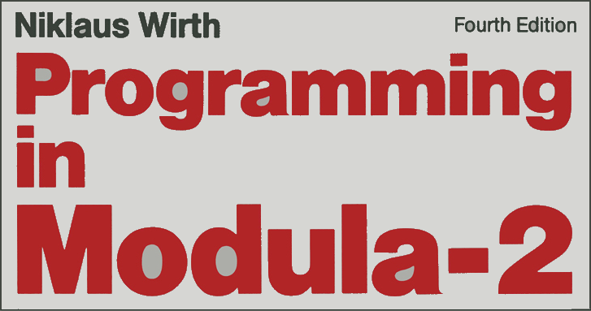
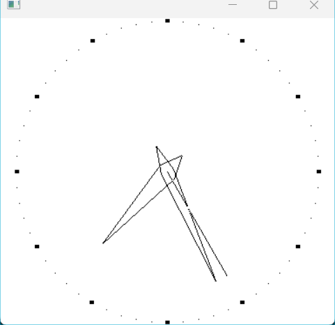

# ADW Modula-2 Examples <a href="../README.md">↩</a>

<table style="font-family:Helvetica,Arial;line-height:1.6;">
  <tr>
  <td style="border:0;padding:0 8px 0 0;;min-width:160px;">
    
  </td>
  <td style="border:0;padding:0;vertical-align:text-top;">
    Directory <strong><code>adw-examples\</code></strong> contains <a href="https://link.springer.com/chapter/10.1007/978-3-642-96757-3_1" rel="external">Modula-2</a> code examples coming from the ADW Modula-2 distribution.
  </td>
  </tr>
</table>

### `Clock` Example

This project has the following directory structure :

<pre style="font-size:80%;">
<b>&gt; <a href="https://learn.microsoft.com/en-us/windows-server/administration/windows-commands/tree" rel="external">tree</a> /f /a . | <a href="https://learn.microsoft.com/en-us/windows-server/administration/windows-commands/findstr" rel="external">findstr</a> /v /b [A-Z]</b>
|   <a href="./Clock/build.bat">build.bat</a>
|   <a href="./Clock/build.sh">build.sh</a>
|   <a href="./Clock/Makefile">Makefile</a>
\---<b>src</b>
    \---<b>main</b>
        \---<b>mod</b>
                <a href="./Clock/src/main/mod/Clock.mod">Clock.mod</a>
</pre>

Command [`build.bat`](./Clock/build.bat)`-verbose clean run` generated and executes :

<pre style="font-size:80%;">
<b>&gt; <a href="./Clock/build.bat">build</a> -verbose clean run</b>
Delete directory "target"
Compile "F:\adw-examples\Clock\target\mod\Clock.MOD" into directory "target\mod"
Modula-2, AMD64. Build ADW 1.6.879
Copyright (c) 2009 by ADW Software

Tokenizing
Reading (.SYM) files
Parsing imported (.SYM) files
Procedure    MAKEINTATOM
Procedure    GlobalDiscard
Procedure    LocalDiscard
Procedure    MAKELANGID
Procedure    PRIMARYLANGID
Procedure    SUBLANGID
Procedure    MAKELCID
Procedure    LANGIDFROMLCID
Procedure    SORTIDFROMLCID
Procedure    ProcThreadAttributeValue
Procedure    PROC_THREAD_ATTRIBUTE_PARENT_PROCESS
Procedure    PROC_THREAD_ATTRIBUTE_HANDLE_LIST
Procedure    PROC_THREAD_ATTRIBUTE_GROUP_AFFINITY
Procedure    PROC_THREAD_ATTRIBUTE_PREFERRED_NODE
Procedure    PROC_THREAD_ATTRIBUTE_IDEAL_PROCESSOR
Procedure    PROC_THREAD_ATTRIBUTE_UMS_THREAD
Procedure    PROC_THREAD_ATTRIBUTE_MITIGATION_POLICY
Procedure    PROC_THREAD_ATTRIBUTE_SECURITY_CAPABILITIES
Procedure    PROC_THREAD_ATTRIBUTE_PROTECTION_LEVEL
[...]
Procedure    WM_ACTIVATE_STATE
Procedure    WM_ACTIVATE_FMINIMIZED
Procedure    WM_ACTIVATE_HWND
Procedure    WM_CHARTOITEM_CHAR
Procedure    WM_CHARTOITEM_CHARW
Procedure    WM_CHARTOITEM_POS
Procedure    WM_CHARTOITEM_HWND
Procedure    WM_COMMAND_ID
Procedure    WM_COMMAND_HWND
Procedure    WM_COMMAND_CMD
[...]]
Procedure    GetTime
Procedure    HourHandPos
Procedure    VertEquiv
Procedure    HorzEquiv
Procedure    CreateTools
Procedure    DeleteTools
Procedure    ClockCreate
Procedure    CircleClock
Procedure    ClockSize
Procedure    DrawFace
Procedure    DrawHand
Procedure    DrawFatHand
Procedure    ClockPaint
Procedure    ClockTimer
Procedure    AboutProc
Procedure    ClockWndProc
Procedure    ClockInit
Main body
Compile memory: 3840
Compile time: 139
Execute ADW linker
Linker. Build ADW 1.6.879
Copyright (C) 2009, by ADW Software

Time = 12
Memory = 1616k
</pre>

<pre style="font-size:80%;">
<b>&gt; <a href="https://learn.microsoft.com/en-us/windows-server/administration/windows-commands/tree" rel="external">tree</a> /a /f target | <a href="https://learn.microsoft.com/en-us/windows-server/administration/windows-commands/findstr">findstr</a> /v /b [A-Z]</b>
|   Clock.exe
|   Clock.map
|   linker_opts.txt
+---<b>mod</b>
|       Clock.MOD
|       Clock.obj
\---<b>sym</b>
        AES.sym
        [...]
        WIN32.sym
        WINUSER.sym
        WINVER.sym
        WINX.sym
</pre>

<!--=======================================================================-->

### `EstimatePi` Example [**&#x25B4;**](#top)

This project has the following directory structure :

<pre style="font-size:80%;">
<b>&gt; <a href="https://learn.microsoft.com/en-us/windows-server/administration/windows-commands/tree" rel="external">tree</a> /f /a . | <a href="https://learn.microsoft.com/en-us/windows-server/administration/windows-commands/findstr" rel="external">findstr</a> /v /b [A-Z]</b>
|   <a href="./EstimatePi/build.bat">build.bat</a>
|   <a href="./EstimatePi/build.sh">build.sh</a>
|   <a href="./EstimatePi/Makefile">Makefile</a>
\---<b>src</b>
    \---<b>main</b>
        +---<b>def</b>
        |       <a href="./EstimatePi/src/main/def/Rand.def">Rand.def</a>
        \---<b>mod</b>
                <a href="./EstimatePi/src/main/mod/EstimatePi.mod">EstimatePi.mod</a>
                <a href="./EstimatePi/src/main/mod/Rand.mod">Rand.mod</a>
</pre>

Command [`build.bat`](./EstimatePi/build.bat)`-verbose clean run` generates and executes the Modula-2 program `target\EstimatePi.exe` :

<pre style="font-size:80%;">
<b>&gt; <a href="./EstimatePi/build.bat">build</a> -verbose clean run</b>
Compile "P:\adw-examples\EstimatePi\target\def\Rand.def" into directory "target\def"
Compile "P:\adw-examples\EstimatePi\target\mod\Rand.mod" into directory "target\mod"
Compile "P:\adw-examples\EstimatePi\target\mod\EstimatePi.mod" into directory "target\mod"
Execute ADW linker
Execute program "target\EstimatePi.exe"
PI by Monte Carlo simulation = 3.14332
PI true value                = 3.14159
</pre>

<!--=======================================================================-->

### `RealSpeedTest` Example [**&#x25B4;**](#top)

This project has the following directory structure :

<pre style="font-size:80%;">
<b>&gt; <a href="https://learn.microsoft.com/en-us/windows-server/administration/windows-commands/tree" rel="external">tree</a> /f /a . | <a href="https://learn.microsoft.com/en-us/windows-server/administration/windows-commands/findstr" rel="external">findstr</a> /v /b [A-Z]</b>
|   <a href="./RealSpeedTest/build.bat">build.bat</a>
|   <a href="./RealSpeedTest/build.sh">build.sh</a>
|   <a href="./RealSpeedTest/Makefile">Makefile</a>
\---<b>src</b>
    \---<b>main</b>
        \---<b>mod</b>
                <a href="./RealSpeedTest/src/main/mod/RealSpeedTest.mod">RealSpeedTest.mod</a>
</pre>

Command [`build.bat`](./RealSpeedTest/build.bat)`-verbose clean run` generates and executes the Modula-2 program `target\RealSpeedTest.exe` :

<pre style="font-size:80%;">
<b>&gt; <a href="./RealSpeedTest/build.bat">build</a> -verbose clean run</b>
Delete directory "target"
Compile "P:\adw-examples\RealSpeedTest\target\mod\RealSpeedTest.mod" into directory "target\mod"
Execute ADW linker
Execute program "target\RealSpeedTest.exe"
REAL     :   156
LONGREAL :   141
</pre>

<!--=======================================================================-->

### `Whetstone_benchmark` Example [**&#x25B4;**](#top)

This project has the following directory structure :

<pre style="font-size:80%;">
<b>&gt; <a href="https://learn.microsoft.com/en-us/windows-server/administration/windows-commands/tree" rel="external">tree</a> /f /a . | <a href="https://learn.microsoft.com/en-us/windows-server/administration/windows-commands/findstr" rel="external">findstr</a> /v /b [A-Z]</b>
|   <a href="./Whetstone_benchmark/build.bat">build.bat</a>
|   <a href="./Whetstone_benchmark/build.sh">build.sh</a>
|   <a href="./Whetstone_benchmark/Makefile">Makefile</a>
\---<b>src</b>
    \---<b>main</b>
        \---<b>mod</b>
                <a href="./Whetstone_benchmark/src/main/mod/Whetstone.mod">Whetstone.mod</a>
</pre>

Command [`build.bat`](./Whetstone_benchmark/build.bat)`-verbose clean run` genreates and executes the Modula-2 program `target\Whetstone.exe` :

<pre style="font-size:80%;">
<b>&gt; <a href="./Whetstone_benchmark/build.bat">build</a> -verbose clean run</b>
Delete directory "target"
Compile "P:\adw-examples\Whetstone_benchmark\target\mod\Whetstone.mod" into directory "target\mod"
Execute ADW linker
Execute program "target\Whetstone.exe"
LOOP   TIME  ITER
# 1   0.000    20     0     0    -0.067    -0.466    -0.733    -1.132
# 2   0.017   120     0     0    -0.068    -0.463    -0.730    -1.124
# 3   0.048   140     0     0    -0.055    -0.447    -0.711    -1.103
# 4   0.006  3450     1     1     0.000     0.000     0.000     0.000
# 6   0.044  2100     1     2     6.000     6.000    -0.711    -1.103
# 7   0.387   320     0     0     0.490     0.490     0.490     0.490
# 8   0.000  8990     0     0     1.000     1.000     1.000     1.000
# 9   0.025  6160     1     2     3.000     2.000     3.000    -1.103
#10   0.000     0     2     3     0.000     0.000     0.000     0.000
#11   0.266   930     0     0     0.835     0.835     0.835     0.835
      0.854

Whetstone KIPS  0
Whetstone MIPS   Infinite
&nbsp;
Press any key to exit
</pre>

***

*[mics](https://lampwww.epfl.ch/~michelou/)/August 2024* [**&#9650;**](#top)
&nbsp;

<!-- href links -->

[apache_ant_cli]: https://ant.apache.org/manual/running.html
[bash_cli]: https://tldp.org/LDP/Bash-Beginners-Guide/html/sect_02_01.html
[cmd_cli]: https://learn.microsoft.com/en-us/windows-server/administration/windows-commands/cmd
[flix]: https://flix.dev/
[gradle_cli]: https://docs.gradle.org/current/userguide/command_line_interface.html
[jar_cli]: https://docs.oracle.com/en/java/javase/13/docs/specs/man/jar.html
[make_cli]: https://www.gnu.org/software/make/manual/make.html
[scala]: https://www.scala-lang.org/
[scalac_cli]: https://docs.scala-lang.org/overviews/compiler-options/index.html
[sh_cli]: https://www.man7.org/linux/man-pages/man1/bash.1.html
