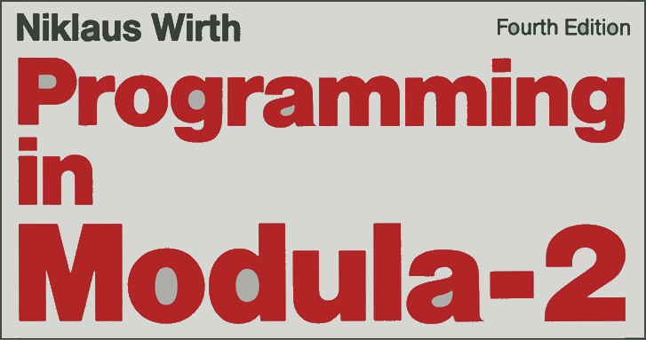

# XDS Modula-2 examples [⬆](../README.md#top)

<table style="font-family:Helvetica,Arial;line-height:1.6;">
  <tr>
  <td style="border:0;padding:0 10px 0 0;min-width:100px;">
    
  </td>
  <td style="border:0;padding:0;vertical-align:text-top;">
    Directory <strong><code>xds-examples\</code></strong> contains <a href="https://link.springer.com/chapter/10.1007/978-3-642-96757-3_1" rel="external" title="Modula-2">Modula-2</a> code examples taken from the XDS Modula-2 distribution.
  </td>
  </tr>
</table>

### `e` Example

This project has the following directory structure :

<pre style="font-size:80%;">
<b>&gt; <a href="https://learn.microsoft.com/en-us/windows-server/administration/windows-commands/tree">tree</a> /f /a . | <a href="https://learn.microsoft.com/en-us/windows-server/administration/windows-commands/findstr">findstr</a> /v /b [A-Z]</b>
|   <a href="./e/build.bat">build.bat</a>
|   <a href="./e/build.sh">build.sh</a>
|   <a href="./e/Makefile">Makefile</a>
\---<b>src</b>
    \---<b>main</b>
        +---<b>mod</b>
        |       <a href="./e/src/main/mod/e.mod">e.mod</a>
        \---<b>mod-adw</b>
                <a href="./e/src/main/mod-adw/e.mod">e.mod</a>
</pre>

Command [`build.bat`](./e/build.bat)`clean run` generates and executes the Modula-2 program `target\e.exe` :

<pre style="font-size:80%;">
<b>&gt; <a href="./e/build.bat">build</a> -verbose clean run</b>
Create XDS project file "target\e.prj"
Compile 1 Modula-2 source file into directory "target"
O2/M2 development system v2.60 TS  (c) 1991-2011 Excelsior, LLC. (build 07.06.2012)
Make project "F:\xds-examples\e\target\e.prj"
XDS Modula-2 v2.40 [x86, v1.50] - build 07.06.2012
Compiling "mod\e.mod"
no errors, no warnings, lines   95, time  0.02
New "tmp.lnk" is generated using template "C:/opt/XDS-Modula-2/bin/xc.tem"

XDS Link Version 2.13.3 Copyright (c) Excelsior 1995-2009.
No errors, no warnings
Execute program "target\e.exe"
Please wait, calculating first 20000 digits of 'e'...
e = 2.71828182845904523536028747135266249775724709369995
      95749669676277240766303535475945713821785251664274
      [...]
      01678781532061600905769340490614617660709438011091
      54432619290007452098959592011594123241022748454826
</pre>

Similarly, command [`build.sh`](./e/build.sh)`clean run` generates and executes the Modula-2 program `target\e.exe` :

<pre style="font-size:80%;">
<b>&gt; <a href="">sh</a> <a href="./e/build.sh">build.sh</a> -verbose clean run</b>
Delete directory "target"
Compile 1 Modula-2 source file into directory "/f/xds-examples/e/target"
O2/M2 development system v2.60 TS  (c) 1991-2011 Excelsior, LLC. (build 07.06.2012)
Make project "F:\xds-examples\e\target\e.prj"
XDS Modula-2 v2.40 [x86, v1.50] - build 07.06.2012
Compiling "F:\xds-examples\e\target\mod\e.mod"
no errors, no warnings, lines   95, time  0.01
New "tmp.lnk" is generated using template "C:/opt/XDS-Modula-2/bin/xc.tem"

XDS Link Version 2.13.3 Copyright (c) Excelsior 1995-2009.
No errors, no warnings
Please wait, calculating first 20000 digits of 'e'...
e = 2.71828182845904523536028747135266249775724709369995
      95749669676277240766303535475945713821785251664274
      [...]
      01678781532061600905769340490614617660709438011091
      54432619290007452098959592011594123241022748454826
</pre>

Finally, command [`make`](https://man7.org/linux/man-pages/man1/make.1.html)`clean run` generates and executes the Modula-2 program `target\e.exe` :

<pre style="font-size:80%;">
<b>&gt; <a href="https://man7.org/linux/man-pages/man1/make.1.html">make</a> --quiet clean run</b>
O2/M2 development system v2.60 TS  (c) 1991-2011 Excelsior, LLC. (build 07.06.2012)
Make project "F:\xds-examples\e\target\e.prj"
XDS Modula-2 v2.40 [x86, v1.50] - build 07.06.2012
Compiling "mod\e.mod"
no errors, no warnings, lines   95, time  0.02
New "tmp.lnk" is generated using template "C:/opt/XDS-Modula-2/bin/xc.tem"

XDS Link Version 2.13.3 Copyright (c) Excelsior 1995-2009.
No errors, no warnings
Please wait, calculating first 20000 digits of 'e'...
e = 2.71828182845904523536028747135266249775724709369995
      95749669676277240766303535475945713821785251664274
      [...]
      01678781532061600905769340490614617660709438011091
      54432619290007452098959592011594123241022748454826
</pre>
<!--=======================================-->

### `exp` Example

This project has the following directory structure :

<pre style="font-size:80%;">
<b>&gt; <a href="https://learn.microsoft.com/en-us/windows-server/administration/windows-commands/tree">tree</a> /f /a . | <a href="https://learn.microsoft.com/en-us/windows-server/administration/windows-commands/findstr">findstr</a> /v /b [A-Z]</b>
|   <a href="./exp/build.bat">build.bat</a>
|   <a href="./exp/build.sh">build.sh</a>
|   <a href="./exp/Makefile">Makefile</a>
\---<b>src</b>
    \---<b>main</b>
        \---<b>mod</b>
               <a href="./exp/src/mod/exp.mod">exp.mod</a>
</pre>

Command [`build.bat`](./exp/build.bat)`clean run` generates and executes the Modula-2 program `target\exp.exe` :

<pre style="font-size:80%;border:1px solid #cccccc;">
<b>&gt; <a href="./build.bat">build</a> -verbose clean run</b>
Create XDS project file "target\exp.prj"
Compile  Modula-2 source file into directory "target"
O2/M2 development system v2.60 TS  (c) 1991-2011 Excelsior, LLC. (build 07.06.2012)
Make project "F:\xds-examples\exp\target\exp.prj"
XDS Modula-2 v2.40 [x86, v1.50] - build 07.06.2012
Compiling "mod\exp.mod"
no errors, no warnings, lines  103, time  0.00
New "tmp.lnk" is generated using template "C:/opt/XDS-Modula-2/bin/xc.tem"

XDS Link Version 2.13.3 Copyright (c) Excelsior 1995-2009.
No errors, no warnings

   e = 2.7182818284590452353602874713526624977572470936999595749669676277
   64    2407663035354759457138217852516642742746639193200305992181741359
  128    6629043572900334295260595630738132328627943490763233829880753195
  192    2510190115738341879307021540891499348841675092447614606680822648
  256    0016847741185374234544243710753907774499206955170276183860626133
  320    1384583000752044933826560297606737113200709328709127443747047230
  384    6969772093101416928368190255151086574637721112523897844250569536
  448    9677078544996996794686445490598793163688923009879312773617821542
  512    4999229576351482208269895193668033182528869398496465105820939239
  576    8294887933203625094431173012381970684161403970198376793206832823
  640    7646480429531180232878250981945581530175671736133206981125099618
  704    1881593041690351598888519345807273866738589422879228499892086805
  768    8257492796104841984443634632449684875602336248270419786232090021
  832    6099023530436994184914631409343173814364054625315209618369088870
  896    7016768396424378140592714563549061303107208510383750510115747704
  960    1718986106873969655212671546889570350354021234078498193343210681
 1024
 </pre>

### `queens` Example [**&#x25B4;**](#top)

This project has the following directory structure :

<pre style="font-size:80%;">
<b>&gt; <a href="https://learn.microsoft.com/en-us/windows-server/administration/windows-commands/tree">tree</a> /f /a . | <a href="https://learn.microsoft.com/en-us/windows-server/administration/windows-commands/findstr">findstr</a> /v /b [A-Z]</b>
|   <a href="./queens/build.bat">build.bat</a>
|   <a href="./queens/build.sh">build.sh</a>
|   <a href="./queens/Makefile">Makefile</a>
\---<b>src</b>
    \---<b>main</b>
        +---<b>def-adw</b>
        |       <a href="./queens/src/main/def-adw/InOut.def">InOut.def</a>
        |       <a href="./queens/src/main/def-adw/Strings.def">Strings.def</a>
        +---<b>mod</b>
        |       <a href="./queens/src/main/mod/queens.mod">queens.mod</a>
        \---<b>mod-adw</b>
                <a href="./queens/src/main/mod-adw/InOut.mod">InOut.mod</a>
                <a href="./queens/src/main/mod-adw/queens.mod">queens.mod</a>
                <a href="./queens/src/main/mod-adw/Strings.mod">Strings.mod</a>
</pre>

Command [`build.bat`](./queens/build.bat)`clean run` generates and executes the Modula-2 program `target\queens.exe` :

<pre style="font-size:80%;border:1px solid #cccccc;">
<b>&gt; <a href="./queens/build.bat">build</a> -verbose clean run</b>
Delete directory "target"
Create XDS project file "target\queens.prj"
Compile  Modula-2 source file into directory "target"
O2/M2 development system v2.60 TS  (c) 1991-2011 Excelsior, LLC. (build 07.06.2012)
Make project "F:\xds-examples\queens\target\queens.prj"
XDS Modula-2 v2.40 [x86, v1.50] - build 07.06.2012
Compiling "mod\queens.mod"
no errors, no warnings, lines   43, time  0.01
New "tmp.lnk" is generated using template "C:/opt/XDS-Modula-2/bin/xc.tem"

XDS Link Version 2.13.3 Copyright (c) Excelsior 1995-2009.
No errors, no warnings
Eight Queens Problem Benchmark
------------------------------

There are 92 solutions
</pre>

The output directory `target\`

<pre style="font-size:80%;border:1px solid #cccccc;">
<b>&gt; <a href="https://learn.microsoft.com/en-us/windows-server/administration/windows-commands/tree" rel="external">tree</a> /a /f target | <a href="https://learn.microsoft.com/en-us/windows-server/administration/windows-commands/findstr" rel="external">findstr</a> /v /b [a-z]</b>
|   queens.exe
|   queens.obj
|   queens.prj
|   tmp.lnk
+---<b>bin</b>
|       Terminal2.dll
|       Terminal2.lib
+---<b>mod</b>
|       queens.mod
\---<b>sym</b>
        Terminal2.sym
</pre>

<pre style="font-size:80%;border:1px solid #cccccc;">
<b>&gt; <a href="https://learn.microsoft.com/en-us/windows-server/administration/windows-commands/type" rel="external">type</a> target\queens.prj</b>
-cpu = 486
-lookup = *.sym = sym;C:\opt\XDS-Modula-2\sym
-lookup = *.dll|*.lib = bin;C:\opt\XDS-Modula-2\bin
-m2
% recognize types SHORTINT, LONGINT, SHORTCARD and LONGCARD
% -m2addtypes
-verbose
-werr
% disable warning 301 (parameter "xxx" is never used)
-woff301+
% disable warning 303 (procedure "xxx" declared but never used)
-woff303+
!module F:\xds-examples\queens\target\mod\queens.mod
!module F:\xds-examples\queens\target\bin\Terminal2.lib
</pre>

***

*[mics](https://lampwww.epfl.ch/~michelou/)/July 2026* [**&#9650;**](#top)
&nbsp;

<!-- link refs -->

[apache_ant_cli]: https://ant.apache.org/manual/running.html
